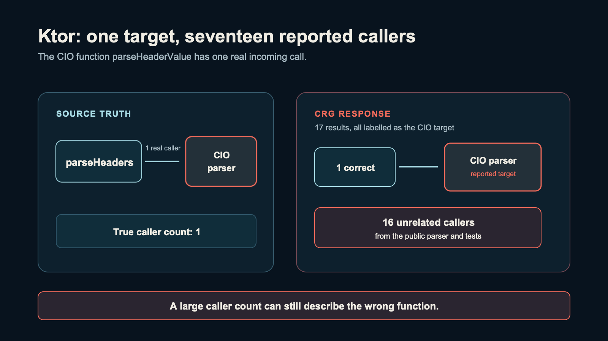
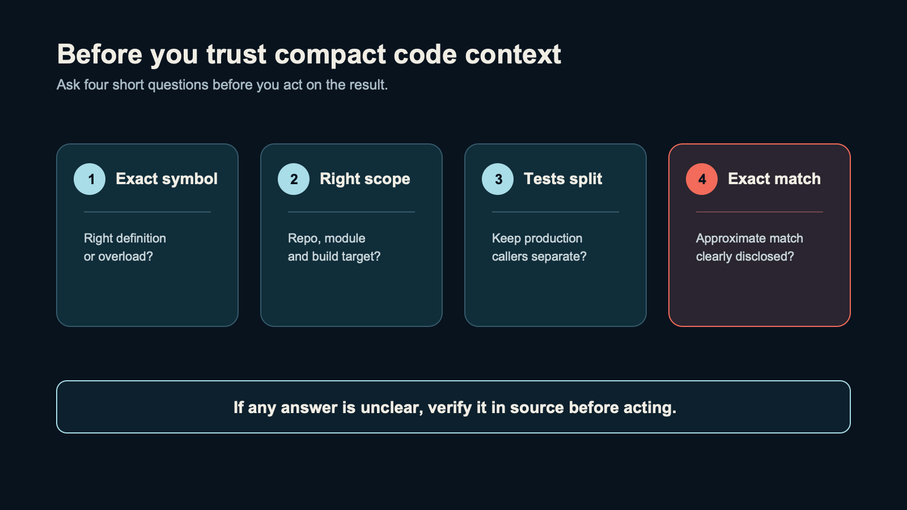

The code graph said that 17 functions called a parser. The source had one.

I was looking for context before an AI agent changed code. The result looked helpful: a short caller list instead of a pile of files. But 16 of the 17 results belonged to another function with the same name.

That changed the question I was asking. I was no longer asking whether a code graph could return less text. I was asking when a compact answer is safe enough to act on.

I ran 14 source-checked retrieval rounds across 12 repositories and eight languages. I did not find one winner. I found four questions that I now ask before trusting a caller list, a "not found" answer, or a compact code summary.

## The four checks

| Case | Tool response | What the source check showed |
|---|---|---|
| Ktor / CRG | 17 callers | 1 real caller; 16 belonged to another overload |
| ripgrep / CRG | 28 callers | 4 production callers and 24 test callers |
| graphify canaries | 3 related results in 12 absent-symbol queries | 3 substitutions; 9 clear "not found" answers |
| FastAPI / Serena | 1 of 4 references from a nested root | 4 of 4 from the repository root on the same commit |

These are different questions with different units. They are not an overall tool ranking. Together they give a practical rule: check the target, scope, test boundary, and match type before an agent acts on the answer.

## 1. Did it resolve the exact function?

> "What could break if I change this parser?"

In Ktor's HTTP module, the tested scope had three functions named `parseHeaderValue`: two public overloads and one low-level parser in the CIO module.

I checked the source. The CIO parser has one caller: `parseHeaders`.

CRG returned 17 callers. One was correct. The other 16 were callers of the public overload and its tests, but the response attributed them to the CIO parser.

A long caller list is not an impact analysis until the tool identifies the definition it resolved. In this round, CBM returned the expected CIO caller. Graphify kept the public and CIO neighborhoods separate. That is a useful result on one difficult Kotlin target, not a claim that either tool handles all Kotlin code correctly.

## 2. Does "all callers" include tests?

> "Which code will I need to change, and which tests will I need to update?"

For ripgrep's `Ignore::add_child`, CRG returned 28 caller records. Twenty-four were marked `is_test: true`; four were outside tests.

The response contained the information, but its total mixed two different decisions. Production callers show possible runtime impact. Test callers show where behavior is checked. A useful answer needs both counts or needs to say which group it omitted.

CBM's saved output was the same with and without `--include-tests true`. So I would inspect the response, not trust the flag name or the total.

## 3. Does "not found" really mean not found?

> "Does this symbol exist in this codebase?"

I used canary names that I had confirmed did not occur in the source. For the ripgrep canary `resolve_deferred_ignore_chain`, graphify returned a real neighborhood beginning at `Ignore` and `resolve_git_commondir()`. It did not say that the exact symbol was absent before showing related code.

The standard canary query produced this substitution in 3 of 12 runs. The other nine returned "No matching nodes found." A related node can be useful as a suggestion, but it is a different answer from a confirmed exact match.

One ng-mocks control made this sharper. `callers of reflectTemplate` returned "No matching nodes found." The reworded `who calls reflectTemplate` returned an unrelated node. That alternate is saved but excluded from the 3-of-12 count because it used a different prompt. When natural-language wording is part of a test, the wording must be fixed in advance.

## 4. Did the setup change the answer?

> "Did the tool search the code I need it to search?"

In the original FastAPI pilot, Serena's lookup for `jsonable_encoder` missed external calls found by a source check. I then ran a separate scope control on `solve_dependencies` at the same commit.

Indexing from the repository root finished in about three seconds and found all 4 known references. Indexing from the nested `fastapi/` package found 1 of 4.

This does not rerun the original `jsonable_encoder` query, and it does not prove a universal rule about Serena. It shows why indexed scope belongs in the answer. The same repository and symbol can produce a complete or incomplete result depending on setup.

## Other ways a compact answer can go wrong

In bbolt, `DB.mmap` is a method and `mmap` is a separate platform-specific function. The method calls the function. Build tags select one of several `mmap` definitions.

CRG found callers of the wrapper method but no callers for the five platform-specific definitions. CBM mixed the wrapper's callers with the wrapper itself. Graphify recorded the definitions as separate nodes but no call edge from wrapper to platform function.

This is a smaller version of the Ktor problem: names are not enough. Build variants, methods and functions with the same name, imports, interfaces, and re-exports all change what a relationship means.

## What this run does not answer

It does not show that an agent completes the same task correctly with less total context, time, or cost. The pilot compared output sizes with reading whole files or packing a module. It did not measure agent retries, total context, time, cost, or final task quality.

The tools also did not run under identical conditions. For example, graphify sometimes used an LLM extraction step, while other rounds did not. I would need a fixed task, scope, build configuration, response format, and task-quality measure before making a token or speed claim.

## What I now do before I act on compact code context

I ask four short questions:

1. Is this the exact symbol and definition I asked for?
2. Did the index include the repository, module, and build target I need?
3. Are production callers and test callers separate?
4. Is this an exact result, an approximate suggestion, or an unresolved match?

The tools also had useful successes: accurate caller lists, separate nodes for ambiguous names, and diagnostics that exposed uncertainty. The saved cases do not support choosing one tool for every repository.

The evidence archive contains the reproducibility manifest, raw tool outputs, and an evidence index that re-derives the four central claims from fresh clones. It does not include third-party repository clones, generated graph databases, or a full benchmark runner. Those can be reconstructed from the manifest. grepai and Augment Context Engine were not evaluated.

My conclusion is narrow: a smaller answer helps only when it keeps the connections the task needs. Token count alone cannot tell me that.

What do you check before trusting a "no callers found" answer from an AI coding tool?
